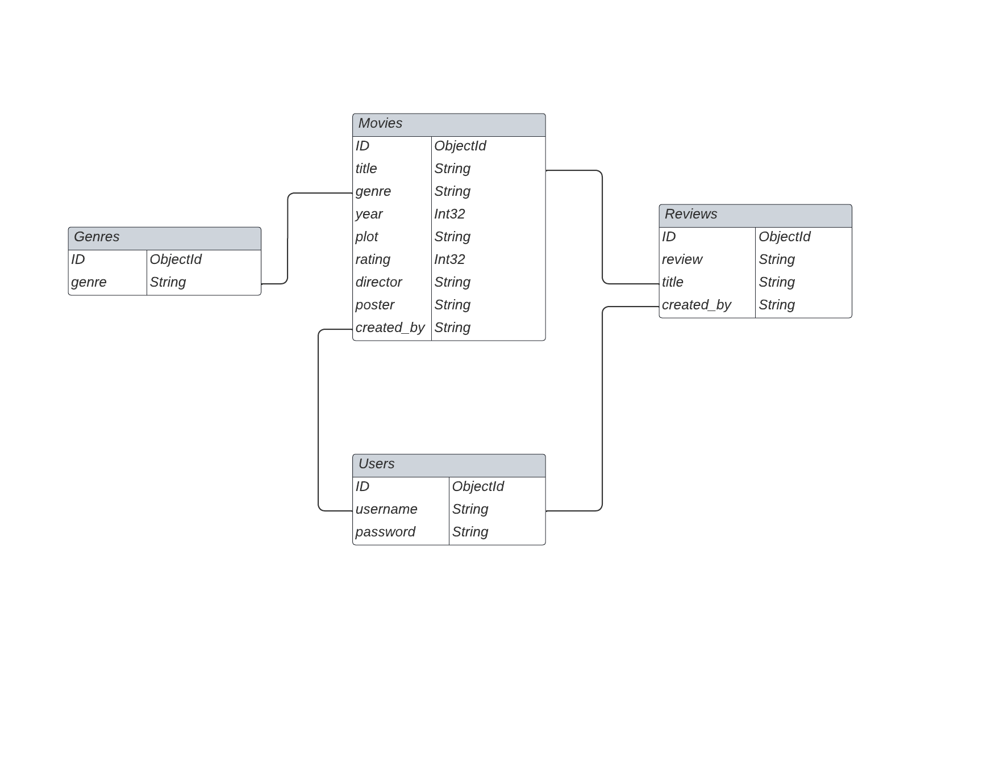
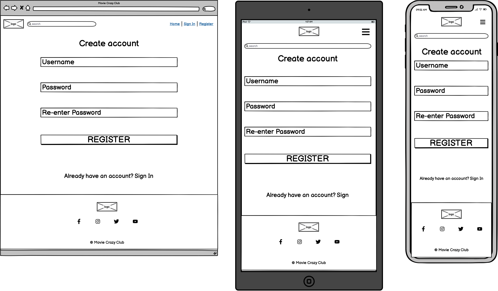
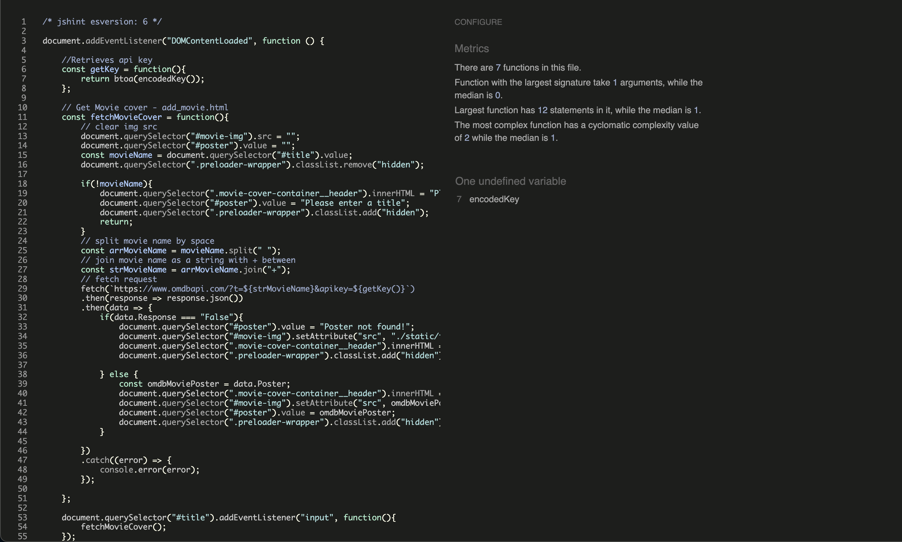

# Movie Crazy Club
(Developer: Femi Ashiru)


[Live Project](https://movie-crazy-club-73ece9687233.herokuapp.com/show_movies)

[Github Repo](https://github.com/ofemiashiru/CI_MS3_MCC)

## Table of Content

1. [Project Goals](#project-goals)
    1. [User Goals](#user-goals)
    2. [Site Owner Goals](#site-owner-goals)
2. [User Experience](#user-experience)
    1. [Target Audience](#target-audience)
    2. [User Requirements and Expectations](#user-requirements-and-expectations)
    3. [User Stories](#user-stories)
    4. [Scope](#scope)
3. [Design](#design)
    1. [Design Choices](#design-choices)
    2. [Colour](#colour)
    3. [Fonts](#fonts)
    4. [Structure](#structure)
    5. [Database Structure](#database-structure)
    6. [Wireframes](#wireframes)
4. [Technologies Used](#technologies-used)
    1. [Languages](#languages)
    2. [Frameworks and Tools](#frameworks-and-tools)
5. [Features](#features)
6. [Testing](#validation)
    1. [HTML Validation](#HTML-validation)
    2. [CSS Validation](#CSS-validation)
    3. [JS Validation](#JS-Validation)
    4. [Python Validation](#python-validation)
    5. [Accessibility](#accessibility)
    6. [Performance](#performance)
    7. [Responsiveness](#responsiveness)
    8. [Device testing](#performing-tests-on-various-devices)
    9. [Browser compatibility](#browser-compatibility)
    10. [Testing user stories](#testing-user-stories) 
7. [Bugs](#Bugs)
8. [Deployment](#deployment)
9. [Credits](#credits)
10. [Acknowledgements](#acknowledgements)


## Project Goals 

### User Goals
- See all movies added to MCC.
- To see reviews of all movies.
- To add movies to MCC.
- To add reviews to movies.

### Site Owner Goals
- To allow users to sign up to MCC.
- To manage the genres on MCC.
- To manage users accounts on MCC.

## User Experience

### Target Audience
- People who are fans of films. 
- People who are part of a film club.

### User Requirements and Expectations

- Easy to use navigation that is responsive.
- Be able to easily browse between sections of the site.
- All links to work as expected.
- Appealing design that works well on both desktop and mobile devices.
- Be able to log in and upload a movie of their choice.
- Be able to add reviews to all movies on the site if logged in.
- Be able to edit/delete users own movies.
- Be able to edit/delete users own reviews.
- All users to be able to search for movies using a search bar feature.
- All users to be able to see movies and reviews
- Accessibility.

### User Stories

#### First-time User 
1. I want to see all movies on MCC.
2. I want to create an account on MCC.
3. I want to add movies on MCC.
4. I want to add reviews on MCC.

#### Returning User
5. I want to log into my MCC account.
6. I want to edit movies on MCC.
7. I want to edit reviews on MCC.
8. I want to delete my movies on MCC.
9. I want delete my reviews on MCC.
10. I want to use the search bar to search movies on MCC.
11. I want to delete my account if no longer needed.

#### Site Owner 
12. I want all users to be able to see all movies.
13. I want all users to be able to see all reviews.
14. I want all users to be able to create an account.
15. I want users who have created accounts to log in and see their profile.
16. I want account users to add a movie.
17. I want account users to edit their own movie.
18. I want account users to delete their own movie.
19. I want account users to add reviews.
20. I want account users to edit their own review.
21. I want account users to delete their own review.
22. I want to be able to log in as admin.
23. I want to be able to add a genre.
24. I want to be able to edit a genre.
25. I want to be able to delete a genre.
26. I want to be able to prompt account users before updating or deleting.
27. I do not want users to use browser back button if they are looking for a page that does not exist.

## Scope

The scope of the project in its first release is defined by the following features:

- Simple navigation that allows user to navigate between sections of the site. 
- Allow users to log into their own accounts and perform CRUD operations on movies and reviews associated to their own account as well as their own account.
- Allow all users to see the stored movies and reviews.
- Allow users to search all the movies that have been added.
- An error page (404.html) and internal server error page (500.html) that appears when visiting a page that does not exist or when an internal server error has been detected.
- Clear and simple favicon icon to help users identify the site.
- Navigation links to show and hide based on logged in and logged out users as well as admin and non-admin users 

Features to be built in future releases:

- Allow admin to review movie submissions to check whether movie has already been added or not. Some movies over time have had the same title so an extra field in the Movies collection that will signify approval that will alert admin so that they can approve it or not.
- Further development to allow admin users to have super user controls and delete reviews and movies.
- Ability for users to add a list of Actors to be submitted into the Movies collection.

## Design

### Design Choices
MMC was designed to mimic the look and feel of iMdb. It was very much styled on that basis however the layout is very simple so that users can accurately locate all the necesarry sections of the site with ease. The majority of the site is style using Materialize components which has helped the site keep a consistent structure and made it fully responsive also. As alot of the images used are being derived from OMDbs api the site colours and layout need to be kept simple. My attempt with this was to see if I could essentially make the design an iMdb/Netflix clone.

### Colour

For the colour scheme I opted to base it on the colour scheme of iMdB.


### Fonts

The main font used in the entirety of the website is "'Roboto', sans-serif". For the logo I opted for 'Bebas Neue', sans-serif which has a similar look to the iMdb logo. Both fonts were imported using Google Fonts API.

### Structure
The site has a total of 14 pages each having certain restrictions based on who is logged in. The entire site is fully responsive and has been tested within the industry standard width of 320px.

The website consists of 14 main pages:
- Main page which shows all movies stored, giving all users the ability to see details and reviews.
- Sign in page that allows returning users to log in to their account.
- Register page that allows visitors to the site to set up their own new accounts.
- Profile page that allows logged in users to see and edit their movies as well as delete their own account. Admin user can also see all the users with accounts and delete them.
- Add and edit movie pages which are only accessible to logged in users.
- Add and edit review pages which are only accessible to logged in users.
- Manage genere page which allows the admin user to see all genres stored and delete them.
- Add and edit genre pages which are only accessible to admin user.


Using Figma I created a conceptual flow chart of how users will navigate throughout the site.


#### What links users can and cannot see:

- All users:
    - Home, Sign In, Register
- Logged in (non-admin user)
    - Home, Profile, Add Movie, Sign Out
- Logged in (admin user)
    - Home, Profile, Add Movie, Manage Genres, Sign Out

- Logged in users can only edit and delete their own reviews and movies.

### Database Structure

Using Lucid chart I created an ERD to show how data will flow and be stored within MongoDB collections.




### Wireframes

<details><summary>movies</summary>

</details>
<details><summary>add_movie</summary>

</details>
<details><summary>edit_movie</summary>

</details>
<details><summary>reviews</summary>

</details>
<details><summary>add_review</summary>

</details>
<details><summary>edit_review</summary>

</details>
<details><summary>genres</summary>

</details>
<details><summary>add_genre</summary>

</details>
<details><summary>edit_genre</summary>

</details>
<details><summary>sign_in</summary>

</details>
<details><summary>register</summary>

</details>
<details><summary>profile</summary>

</details>
<details><summary>404</summary>

</details>
<details><summary>500</summary>

</details>


## Technologies Used

### Languages
- HTML
- CSS
- JavaScript
- Python

### Frameworks and Tools
- Flask
- Materialise
- MongoDB
- Git
- GitHub
- CodeAnywhere
- Balsamiq
- Google Fonts
- Adobe Color
- Font Awesome
- Favicon<span>.</span>io
- Lucid
- Figma
- OMDb API

## Features

### Logo Navigation and Search bar
- Navigation and Logo remains consistent on each page
- Navigation and search bar are fully responsive and collapse when window is resized
- Navigation allows users to easily navigate the site and search bar allows users to search movies (User story 9)
- Logo in Navigation takes user back to the main page

<p>Nav on Desktop, tablet and mobile</p>


### Movie Section
- Displays all movies uploaded, with choice to leave review, edit or delete movie  (User story 1, 4, 5, 7, 11, 12, 16, 17)


### Footer
- Displays logo, copyright and social links 


### Sign In
- Allows users to sign into their own account  (User Story 5, 14, 15)


### Register
- Allows users to register with MCC  (User Story 2)


### Add Movie
- Allows users to add a movie  (User Story 3, 16)


### Edit Movie
- Allows users to edit their own movie  (User Story 6, 17)


## Validation

### HTML Validation
The W3C Markup Validation Service was used to validate the HTML of the website. 

movies.html [results](https://validator.w3.org/nu/?doc=https%3A%2F%2Fmovie-crazy-club-73ece9687233.herokuapp.com%2Fshow_movies) - No Errors Found

add_movie.html [results](https://validator.w3.org/nu/?doc=https%3A%2F%2Fmovie-crazy-club-73ece9687233.herokuapp.com%2Fadd_movie) - No Errors Found

edit_movie.html [results](https://validator.w3.org/nu/?doc=https%3A%2F%2Fmovie-crazy-club-73ece9687233.herokuapp.com%2Fedit_movie%2F64aa76200062b2ede6c081c1) - No Errors Found

reviews.html [results](https://validator.w3.org/nu/?doc=https%3A%2F%2Fmovie-crazy-club-73ece9687233.herokuapp.com%2Fshow_reviews%2F64aa76200062b2ede6c081c1) - No Errors Found

add_review.html [results](https://validator.w3.org/nu/?doc=https%3A%2F%2Fmovie-crazy-club-73ece9687233.herokuapp.com%2Fadd_review%2F64aa76200062b2ede6c081c1) - No Errors Found

edit_review.html [results](https://validator.w3.org/nu/?doc=https%3A%2F%2Fmovie-crazy-club-73ece9687233.herokuapp.com%2Fedit_review%2F64b4941eac9e68e3acbbbb53) - No Errors Found

sign_in.html [results](https://validator.w3.org/nu/?doc=https%3A%2F%2Fmovie-crazy-club-73ece9687233.herokuapp.com%2Fsign_in) - No Errors Found

register.html [results](https://validator.w3.org/nu/?doc=https%3A%2F%2Fmovie-crazy-club-73ece9687233.herokuapp.com%2Fregister) - No Errors Found

profile.html [results](https://validator.w3.org/nu/?doc=https%3A%2F%2Fmovie-crazy-club-73ece9687233.herokuapp.com%2Fprofile%2Fajasko) - No Errors Found

profile.html - admin [results](https://validator.w3.org/nu/?doc=https%3A%2F%2Fmovie-crazy-club-73ece9687233.herokuapp.com%2Fprofile%2Fadmin) - No Errors Found

genres.html - admin [results](https://validator.w3.org/nu/?doc=https%3A%2F%2Fmovie-crazy-club-73ece9687233.herokuapp.com%2Fshow_genres) - No Errors Found

add_genre.html - admin [results](https://validator.w3.org/nu/?doc=https%3A%2F%2Fmovie-crazy-club-73ece9687233.herokuapp.com%2Fadd_genre) - No Errors Found

edit_genre.html - admin [results](https://validator.w3.org/nu/?doc=https%3A%2F%2Fmovie-crazy-club-73ece9687233.herokuapp.com%2Fedit_genre%2F64ba84070878e37c4dd6a478) No Errors Found

### CSS Validation
The W3C Jigsaw CSS Validation Service was used to validate the CSS of the website.
After testing the whole sites CSS and my own custom CSS all pages passed with no errors, however, there were a number of warnings present that were related to the webkit css extensions used.

whole site [results](https://jigsaw.w3.org/css-validator/validator?uri=https%3A%2F%2Fmovie-crazy-club-73ece9687233.herokuapp.com%2F&profile=css3svg&usermedium=all&warning=1&vextwarning=&lang=en) - 1 Error found in the materialize.min.css

custom css [results](https://jigsaw.w3.org/css-validator/validator?uri=https%3A%2F%2Fmovie-crazy-club-73ece9687233.herokuapp.com%2Fstatic%2Fcss%2Fstyle.css&profile=css3svg&usermedium=all&warning=1&vextwarning=&lang=en) - No Errors Found

### JS Validation

[JS Hint](https://jshint.com/) was used to validate the JavaScript of the website.

<details><summary>script.js</summary>

</details>

<details><summary>register.js</summary>

</details>

<details><summary>drop_down_validator.js</summary>

</details>

<details><summary>in_html_script located in add_moveie.html and edit_movie.html</summary>
<p>One unused variable warning however it is used within fetch_movie_poster.js</p>

</details>

<details><summary>fetch_movie_poster.js</summary>
<p>One undefined variable warning however it is defined within in script for add and edit movie pages to hide api key</p>

</details>

<details><summary>character_count.js</summary>

</details>


### Python Validation

[Python Linter](https://pep8ci.herokuapp.com/) was used to test and validate the Python used in app.py

- app.py - No Errors


### Accessibility
The WAVE WebAIM web accessibility tool was used to ensure the website met accessibility standards. 

movies.html [results](https://wave.webaim.org/report#/https://movie-crazy-club-73ece9687233.herokuapp.com/show_movies) - No Errors Found.

sign_in.html [results](https://wave.webaim.org/report#/https://movie-crazy-club-73ece9687233.herokuapp.com/sign_in) - No Errors Found.

register.html [results](https://wave.webaim.org/report#/https://movie-crazy-club-73ece9687233.herokuapp.com/register) - No Errors Found.

404.html [results](https://wave.webaim.org/report#/https://movie-crazy-club-73ece9687233.herokuapp.com/profilesdfd)

### Performance 
Google Lighthouse Tool was used to test the performance of the website. 
<details><summary>movies</summary>

</details>
<details><summary>reviews</summary>

</details>
<details><summary>genres</summary>

</details>
<details><summary>sign_in</summary>

</details>
<details><summary>register</summary>

</details>
<details><summary>profile</summary>

</details>
<details><summary>add_movie</summary>

</details>
<details><summary>add_review</summary>

</details>
<details><summary>add_genre</summary>

</details>
<details><summary>edit_movie</summary>

</details>
<details><summary>edit_review</summary>

</details>
<details><summary>edit_genre</summary>

</details>

### Performing tests on various devices 
The website was tested on the following devices:
- Apple MacBook Pro M1
- Apple iPhone 11
- Xiaomi Mi 11 Lite

### Browser compatibility
The website was tested on the following browsers:
- Google Chrome
- Safari
- Mozilla Firefox
- Microsoft Edge

### Responsiveness
The website is completely responsive and has been tested on mobile, tablet and desktop:

<details><summary>Mobile, Tablet and Desktop</summary>

</details>


### Testing user stories

- Please note that these screen recordings were taken before the play now buttons and quiz were added
- However the quiz itself has been added to fulfil user story 14

1. I want to play the QuickShot game.

| **Feature** | **Action** | **Expected Result** | **Actual Result** |
|-------------|------------|---------------------|-------------------|
| Nav and Game Page | Click play game on Nav in index.html and start game on game.html | Game.html page opens and game should start when start game is clicked | Works as expected |

<details><summary>Screen recording</summary>

</details>

2. I want to save my score on the leader board.

| **Feature** | **Action** | **Expected Result** | **Actual Result** |
|-------------|------------|---------------------|-------------------|
| Game Page | When game over screen appears, enter name and click save | Main page should open and smooth scroll to leader board section showing newly added score if it is in the top ten | Works as expected |

<details><summary>Screen recording</summary>

</details>

3. I want to see the leader board.

| **Feature** | **Action** | **Expected Result** | **Actual Result** |
|-------------|------------|---------------------|-------------------|
| Nav | Click leader board on Nav in index.html | Main page should smooth scroll to leader board section | Works as expected |

<details><summary>Screen recording</summary>

</details>

4. I want to contact QuickShot game site

| **Feature** | **Action** | **Expected Result** | **Actual Result** |
|-------------|------------|---------------------|-------------------|
| Contact Section | Click contact on Nav in index.html, enter details in text boxes and click send button | Page should smooth scroll to contact section, allow user to enter fields and only send if all fields are entered. On clicking send a message should appear beneath informing user of whether or not the message was sent successfully | Works as expected |

<details><summary>Screen recording/ Screenshot</summary>


</details>


5. I want to see all the top ten scores.

| **Feature** | **Action** | **Expected Result** | **Actual Result** |
|-------------|------------|---------------------|-------------------|
| Nav | Click leader board on Nav in index.html | Main page should smooth scroll to leader board section | Works as expected |

<details><summary>Screen recording</summary>

</details>

6. I want to be able to see if I can top the leader board.

| **Feature** | **Action** | **Expected Result** | **Actual Result** |
|-------------|------------|---------------------|-------------------|
| Nav and Game Page | Click play game on Nav in index.html and start game on game.html | Game.html page opens and game should start when start game is clicked | Works as expected |

<details><summary>Screen recording</summary>

</details>

7. I want to be able to contact QuickShot game site.

| **Feature** | **Action** | **Expected Result** | **Actual Result** |
|-------------|------------|---------------------|-------------------|
| Contact Section | Click contact on Nav in index.html, enter details in text boxes and click send button | Page should smooth scroll to contact section, allow user to enter fields and only send if all fields are entered. On clicking send a message should appear beneath informing user of whether or not the message was sent successfully | Works as expected |

<details><summary>Screen recording/ Screenshot</summary>


</details>


8. I want users to be able to play QuickShot game on mobile, tablet and desktop.

| **Feature** | **Action** | **Expected Result** | **Actual Result** |
|-------------|------------|---------------------|-------------------|
| Nav and Game Page | Click play game on Nav in index.html and start game on game.html | Game.html page opens and game should start when start game is clicked | Works as expected |

<details><summary>Screen recording</summary>

</details>

9. I want users to be able to save their score to the leader board.

| **Feature** | **Action** | **Expected Result** | **Actual Result** |
|-------------|------------|---------------------|-------------------|
| Game Page | When game over screen appears, enter name and click save | Main page should open and smooth scroll to leader board section showing newly added score if it is in the top ten | Works as expected |

<details><summary>Screen recording</summary>

</details>

10. I want users to be able to see the top ten scores.

| **Feature** | **Action** | **Expected Result** | **Actual Result** |
|-------------|------------|---------------------|-------------------|
| Nav | Click leader board on Nav in index.html | Main page should smooth scroll to leader board section | Works as expected |

<details><summary>Screen recording</summary>

</details>

11. I want users to be able to contact us.

| **Feature** | **Action** | **Expected Result** | **Actual Result** |
|-------------|------------|---------------------|-------------------|
| Contact Section | Click contact on Nav in index.html, enter details in text boxes and click send button | Page should smooth scroll to contact section, allow user to enter fields and only send if all fields are entered. On clicking send a message should appear beneath informing user of whether or not the message was sent successfully | Works as expected |

<details><summary>Screen recording/ Screenshot</summary>


</details>


12. I do not want users to use browser back button if they are looking for a page that does not exist.

| **Feature** | **Action** | **Expected Result** | **Actual Result** |
|-------------|------------|---------------------|-------------------|
| 404 Page| Enter incorrect URI in address bar| 404 page should appear with Header and footer allowing user to navigate to a different page | Works as expected |

<details><summary>Screen recording</summary>

</details>


13. Inform users that the game will be coming to App store and Google Play soon

| **Feature** | **Action** | **Expected Result** | **Actual Result** |
|-------------|------------|---------------------|-------------------|
| Nav and Hero Section | Click Home on Nav in index.html | Page should smooth scroll to home section show users that QuickShot will be coming to App Store and Google Play store soon (Desktop only) | Works as expected |

<details><summary>Screenshots</summary>

</details>

14. I want users to take a quiz that tests their video game knowledge, to pass the time.

| **Feature** | **Action** | **Expected Result** | **Actual Result** |
|-------------|------------|---------------------|-------------------|
| Quiz Section | Complete quiz in index.html | Quiz section should ask 10 questions one by one giving feedback for each response and give a total at the end of quiz allowing user to restart | Works as expected |

<details><summary>Screenshots</summary>

</details>

| **Feature** | **Action** | **Expected Result** | **Actual Result** |
|-------------|------------|---------------------|-------------------|
| Quiz Section | Choose no value for quiz question | Message should appear informing user to choose a value | Works as expected |

<details><summary>Screenshots</summary>

</details>


## Bugs

| **Bug** | **Fix** | 
|-------------|------------|
|Receiving the error message ```An invalid form control with name='' is not focusable``` when submitting answer without picking true or false|As the element created was set to required the DOM was searching for the element but could not find it as I set it the display property to none - created custom validation within the quiz.js file starting on line 170 to handle non input.|


## Deployment

Deployed using GitHub Pages using the following steps:
1. Whilst in GitHub repository navigate to the Settings tab
2. On the left hand menu select Pages
3. Scroll to "Branch" tap none to show the different options and select "main"
4. Click save and the site will be published. You will see "Your site is live at https://ofemiashiru.github.io/CI_MS2_QSG/"

You can also fork the repository by:
1. Navigating to the GitHub repository
2. Click on "Fork" button in top right hand corner (Please note you must be signed in to Fork a repository)

You can clone the repository by:
1. Navigating to GitHub repository 
2. Locate the "Code" button above the file list and click it 
3. Select if you prefer to clone using HTTPS, SSH, or Github CLI and click the copy button to copy the URL to your clipboard
4. Open Git Bash
5. Change the current working directory to where you wish to clone the directory
6. Type ```git clone``` and paste in the URL from the clipboard e.g ```$ git clone https://github.com/YOUR-USERNAME/YOUR-REPOSITORY)```
7. Press Enter to create your local clone in your chosen folder.

## Credits

### Media

- Movie Wallpaper background | soure: [Wallpapers.com](https://wallpapers.com/)

- All movie poster images are API generated from [OMDb](https://www.omdbapi.com/).

### Code

- Used [Flask Documentation](https://flask.palletsprojects.com/en/1.1.x/patterns/errorpages/) to add error routes for 404 and 500.

- Used [Code Institute Github Solutions](https://github.com/Code-Institute-Solutions/TaskManagerAuth/blob/main/04-AddingATask-WritingToTheDatabase/02-materialize-select-validation/static/js/script.js) to assist with validating materializes drop down correctly.

- Used [Python Basics](https://pythonbasics.org/flask-redirect-and-errors/), [w3schools](https://www.w3schools.com/python/python_regex.asp) and [Pythex](https://pythex.org/) for regex and abort class on `valid_object_id` function in app.py

## Acknowledgements

I would like to take the opportunity to thank:
- Mo Shami for continued mentorship, guidance and support throughout this project. 
- Iris Smok for continued encouragement whilst working on this project.
- and all the Teaching and Non-teaching Personnel at Code Institute.